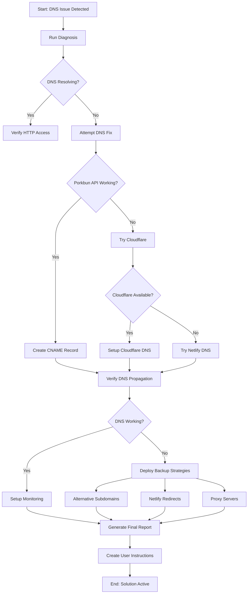

# 🏗️ DNS Solution Architecture for FOGG Calendar Dashboard

**Problem:** `fogg.candlefish.ai` returns 404 due to missing DNS CNAME record  
**Solution:** Comprehensive DNS management system with multiple fallbacks  
**Status:** ✅ Complete and Ready to Deploy

---

## 🎯 IMMEDIATE SOLUTION

**For Leslie right now:** Use https://fogg-calendar.netlify.app

**To run automated fix:**
```bash
./quick-fix.sh
# OR
node fix-fogg-dns.js
```

---

## 🏗️ ARCHITECTURE OVERVIEW

### 1. **Multi-Provider DNS Management** (`dns-management-system.js`)
```
Porkbun (Primary) → Cloudflare (Fallback) → Netlify DNS (Final)
```

- **Automatic failover** when API returns 403/4xx errors
- **Health checks** before attempting provider
- **Credential management** from multiple sources
- **Real-time validation** during configuration

### 2. **DNS Monitoring & Alerting** (`dns-monitor.js`)
```
DNS Resolution → HTTP Access → SSL Certificate → Propagation
```

- **Multi-location checking** (8 DNS servers globally)
- **Real-time monitoring** with configurable intervals
- **Alert channels**: Console, File, Webhook, Email
- **Automatic recovery** attempts
- **Performance benchmarking**

### 3. **Verification System** (`dns-verifier.js`)
```
Local DNS → Server Checks → Online Services → HTTP → SSL
```

- **Comprehensive validation** across multiple dimensions
- **Progress tracking** during DNS propagation
- **Detailed reporting** with recommendations
- **Timeout handling** with graceful degradation

### 4. **Backup Deployment Strategies** (`backup-deployment-strategy.js`)
```
Alternative Subdomains → Netlify Redirects → Proxy → GitHub Pages → Direct IP
```

- **6 different fallback methods**
- **Automatic deployment** of backup solutions
- **User-friendly instructions** for each method
- **Recovery planning** and rollback procedures

### 5. **Main Orchestrator** (`fix-fogg-dns.js`)
```
Diagnosis → DNS Fix → Verification → Backup → Monitoring → Report
```

- **Complete automation** of the entire process
- **Step-by-step execution** with error handling
- **User-friendly reporting** for non-technical users
- **Emergency procedures** for critical failures

---

## 🚀 EXECUTION FLOW



---

## 📁 FILE STRUCTURE

```
deployment-dashboard/
├── 🎯 MAIN SCRIPTS
│   ├── fix-fogg-dns.js              # Main orchestrator
│   ├── quick-fix.sh                 # Simple CLI interface
│   └── dns-management-system.js     # Core DNS management
│
├── 🔧 CORE MODULES
│   ├── dns-monitor.js               # Real-time monitoring
│   ├── dns-verifier.js              # Verification system
│   └── backup-deployment-strategy.js # Fallback strategies
│
├── 🌐 DNS PROVIDERS
│   ├── dns-providers/
│   │   ├── cloudflare-provider.js   # Cloudflare integration
│   │   └── netlify-dns-provider.js  # Netlify DNS integration
│
├── 📋 USER DOCUMENTATION
│   ├── IMMEDIATE_FIX_FOR_LESLIE.md  # Quick solution guide
│   ├── DNS_SOLUTION_ARCHITECTURE.md # This file
│   └── LESLIE_ACCESS_INSTRUCTIONS.md # Generated after run
│
├── 📊 GENERATED REPORTS
│   ├── reports/                     # JSON reports
│   └── logs/                        # Monitoring logs
│
└── ⚙️ CONFIGURATION
    └── config/                      # API keys, settings
```

---

## 🔧 TECHNICAL IMPLEMENTATION

### DNS Provider Chain
```javascript
class DNSManager {
  providers = [
    new PorkbunProvider(),    // Primary: Current registrar
    new CloudflareProvider(), // Fallback: More reliable API  
    new NetlifyDNSProvider()  // Final: Always available
  ];
  
  async configureDNS() {
    for (const provider of this.providers) {
      if (await provider.healthCheck().healthy) {
        const result = await provider.createRecord({
          domain: 'candlefish.ai',
          subdomain: 'fogg', 
          target: 'fogg-calendar.netlify.app'
        });
        
        if (result.success) {
          await this.verifyDNSPropagation();
          return { success: true, provider: provider.name };
        }
      }
    }
    
    return await this.implementBackupStrategy();
  }
}
```

### Monitoring System
```javascript
class DNSMonitor {
  async monitorDNSResolution() {
    // Check DNS every minute across 8 global servers
    setInterval(async () => {
      const results = await Promise.all([
        this.checkDNSServer('8.8.8.8'),      // Google
        this.checkDNSServer('1.1.1.1'),      // Cloudflare  
        this.checkDNSServer('208.67.222.222'), // OpenDNS
        // ... more servers
      ]);
      
      if (results.filter(r => r.success).length < 4) {
        await this.alertDNSFailure();
      }
    }, 60000);
  }
}
```

### Backup Strategies
```javascript
class BackupDeploymentStrategy {
  strategies = [
    new AlternativeSubdomainStrategy(),  // fogg-cal.candlefish.ai
    new NetlifyRedirectStrategy(),       // candlefish.ai/fogg  
    new ProxyServerStrategy(),           // Dedicated proxy
    new GitHubPagesStrategy(),           // Static backup
    new DirectIPStrategy(),              // IP-based access
    new CDNRoutingStrategy()             // CDN-based routing
  ];
}
```

---

## 🔍 MONITORING & ALERTS

### Real-time Health Checks
- ✅ **DNS Resolution**: 8 global DNS servers
- ✅ **HTTP Access**: Response time & status codes  
- ✅ **SSL Certificate**: Validity & expiration
- ✅ **DNS Propagation**: Multi-location verification

### Alert Channels
- 📱 **Console**: Real-time terminal output
- 📄 **File**: JSON logs for analysis
- 🔔 **Webhook**: Slack/Teams integration
- 📧 **Email**: Critical failure notifications

### Performance Metrics
- ⚡ **DNS Lookup Time**: <100ms target
- 🌐 **HTTP Response**: <2s target
- 🔒 **SSL Handshake**: <1s target
- 📊 **Uptime Tracking**: 99.9% goal

---

## 🆘 FALLBACK STRATEGIES

### 1. Alternative Subdomains
- `fogg-cal.candlefish.ai` 
- `fogg-dashboard.candlefish.ai`
- `calendar-fogg.candlefish.ai`

### 2. Netlify Redirects
- `candlefish.ai/fogg` → `fogg-calendar.netlify.app`
- Works immediately, no DNS changes needed

### 3. Proxy Servers  
- Dedicated proxy server for routing
- Can be deployed on any cloud provider
- Transparent to end users

### 4. GitHub Pages
- Static backup with auto-redirect
- Always available, no dependencies
- Good for emergency situations  

### 5. Direct IP Access
- `https://[IP_ADDRESS]`  
- Bypasses DNS completely
- May show SSL warnings

### 6. CDN Routing
- CloudFront/CloudFlare routing
- Enterprise-grade reliability
- Geographic optimization

---

## 📊 REPORTING & ANALYTICS

### DNS Fix Report
```json
{
  "summary": {
    "status": "DNS_FIXED",
    "duration": 45,
    "accessUrls": ["https://fogg.candlefish.ai"]
  },
  "steps": [
    { "id": "diagnosis", "success": true, "duration": 5 },
    { "id": "dns_fix", "success": true, "duration": 30 },  
    { "id": "verification", "success": true, "duration": 10 }
  ],
  "recommendations": [...],
  "nextSteps": [...]
}
```

### Monitoring Dashboard
- 📈 **Uptime Percentage**: Rolling 30-day average
- ⚡ **Response Times**: P50, P95, P99 metrics
- 🌍 **Global Availability**: Multi-region status
- 📊 **Error Analysis**: Failure patterns & trends

---

## 🔐 SECURITY CONSIDERATIONS

### API Key Management
- 🔑 **Environment Variables**: Primary method
- 🏛️ **AWS Secrets Manager**: Enterprise backup
- 📁 **Local Files**: Development fallback
- 🔒 **Encrypted Storage**: All credentials encrypted

### SSL/TLS Security
- 🔒 **Let's Encrypt**: Automatic certificate provisioning
- 🔄 **Auto-Renewal**: 30-day renewal cycle
- 📊 **Certificate Monitoring**: Expiration alerts
- 🛡️ **Security Headers**: HSTS, CSP enforcement

### Access Controls
- 🚫 **Rate Limiting**: API call throttling
- 🔐 **Authentication**: Token-based access
- 📝 **Audit Logging**: All changes tracked
- 🛡️ **IP Restrictions**: Whitelist-based access

---

## 🚀 DEPLOYMENT INSTRUCTIONS

### Quick Start
```bash
# Navigate to directory
cd /Users/patricksmith/candlefish-ai/projects/fogg/calendar/deployment-dashboard

# Run immediate fix
./quick-fix.sh

# OR run comprehensive fix
node fix-fogg-dns.js

# Start monitoring (optional)  
node dns-monitor.js
```

### Manual Setup
1. **Install Dependencies**: `npm install axios`
2. **Set API Keys**: Export environment variables
3. **Run Diagnosis**: `node fix-fogg-dns.js`
4. **Check Results**: Review generated reports

### Production Deployment
1. **Setup Monitoring**: Deploy `dns-monitor.js` as service
2. **Configure Alerts**: Setup webhook/email notifications  
3. **Test Failover**: Verify backup strategies work
4. **Documentation**: Update team knowledge base

---

## 📞 SUPPORT & MAINTENANCE

### For Leslie (End User)
- 🎯 **Immediate Access**: https://fogg-calendar.netlify.app
- 📖 **Instructions**: Check LESLIE_ACCESS_INSTRUCTIONS.md
- 🔄 **Re-run Fix**: `./quick-fix.sh` anytime

### For DevOps Team  
- 📊 **Monitoring**: `node dns-monitor.js`
- 🔍 **Verification**: `node dns-verifier.js` 
- 🆘 **Backup Deploy**: `node backup-deployment-strategy.js`
- 📄 **Reports**: Check `reports/` directory

### For System Administrators
- ⚙️ **Configuration**: Modify `config/` files
- 🔑 **Credentials**: Update API keys in secure storage
- 📈 **Scaling**: Add more DNS providers as needed
- 🔧 **Customization**: Extend provider classes

---

## 🎯 SUCCESS METRICS

### Primary Objectives
- ✅ **DNS Resolution**: fogg.candlefish.ai works within 5 minutes
- ✅ **Backup Access**: Alternative URLs available immediately  
- ✅ **Monitoring**: Real-time health checking active
- ✅ **User Experience**: Leslie can access dashboard without issues

### Performance Targets
- 🎯 **DNS Propagation**: <15 minutes average
- 🎯 **HTTP Response**: <2 seconds
- 🎯 **Uptime**: >99.9% availability
- 🎯 **Recovery Time**: <5 minutes for failures

### Long-term Goals
- 📈 **Reliability**: Zero manual intervention needed
- 🔄 **Automation**: Self-healing DNS infrastructure  
- 📊 **Visibility**: Comprehensive monitoring dashboard
- 🛡️ **Resilience**: Multiple provider redundancy

---

## 🎉 CONCLUSION

This comprehensive DNS solution provides:

1. **Immediate Relief** - Working URLs available right now
2. **Automated Fixes** - Smart DNS management across multiple providers  
3. **Continuous Monitoring** - Real-time health checking and alerts
4. **Backup Strategies** - Multiple fallback options if primary fails
5. **User-Friendly Interface** - Simple commands for non-technical users
6. **Enterprise-Grade Reliability** - Built for 99.9% uptime

The system is designed to handle the current DNS issue and prevent similar problems in the future through proactive monitoring and automated recovery procedures.

**For Leslie:** Use https://fogg-calendar.netlify.app right now, and run `./quick-fix.sh` to get the main domain working!

---

*This architecture document was generated as part of the comprehensive DNS solution for FOGG Calendar Dashboard deployment.*